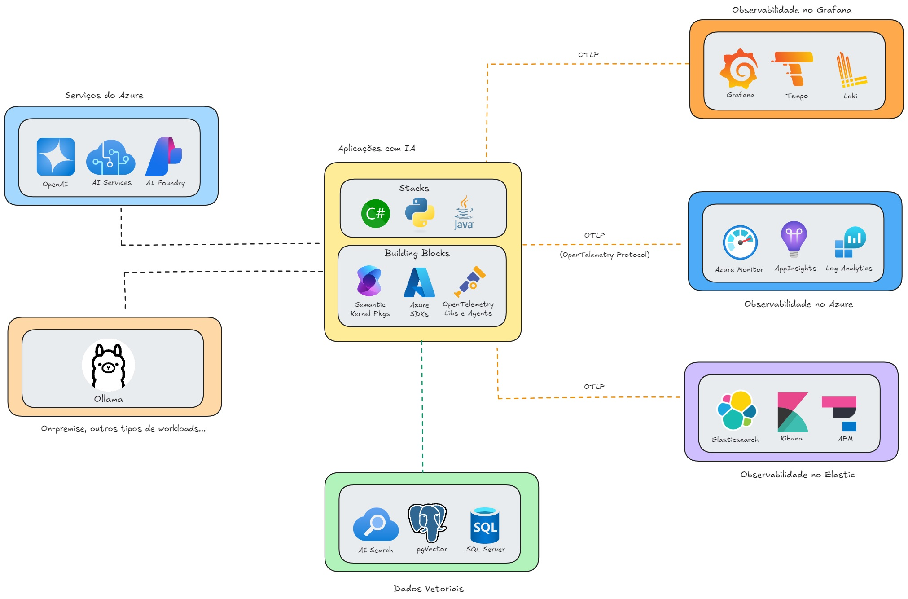

# opentelemetry-ias
Repositório com recursos para implementação de Observabilidade com OpenTelemetry em aplicações que façam uso de recursos de IA.

Escaneie o código para acessar o repo:

---

Exemplos de implementação (todos utilizando OpenTelemetry + Semantic Kernel + .NET 9 + Azure OpenAI + Ollama + Docker Compose):
- [Application Insights](https://github.com/renatogroffe/dotnet9-semantickernel-postgres-otel-azureappinsights_consultaprodutos)
- [Elastic APM](https://github.com/renatogroffe/dotnet9-semantickernel-postgres-otel-elasticapm_consultaprodutos)
- [Grafana](https://github.com/renatogroffe/dotnet9-semantickernel-postgres-otel-grafana_consultaprodutos)
- [Jaeger](https://github.com/renatogroffe/dotnet9-semantickernel-postgres-otel-jaeger_consultaprodutos)

---

## Um exemplo de arquitetura

